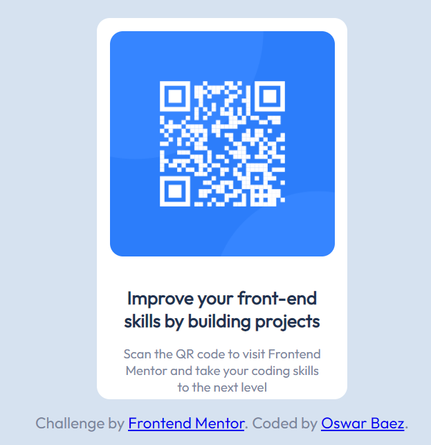

# Frontend Mentor - QR code component solution

This is a solution to the [QR code component challenge on Frontend Mentor](https://www.frontendmentor.io/challenges/qr-code-component-iux_sIO_H). Frontend Mentor challenges help you improve your coding skills by building realistic projects. 

## Table of contents

- [Overview](#overview)
  - [Screenshot](#screenshot)
  - [Links](#links)
- [My process](#my-process)
  - [Built with](#built-with)
  - [What I learned](#what-i-learned)
  - [Continued development](#continued-development)
- [Author](#author)

## Overview
This is a QR component solution, easy and responsive
### Screenshot

### Links

- Solution URL: [Add solution URL here](https://github.com/Orlando2601/QR-Component-Solution.git)

## My process
Learn a little bit HTML, CSS
### Built with

- Semantic HTML5 markup
- CSS custom properties
- Flexbox

### What I learned
I improved my html and css skills, using mobile first and responsive work. It was a perfect choice to beginners

### Continued development

I will learn about react and more tips about css

## Author

- Website - [Oswar Orlando Baez](https://github.com/Orlando2601)
- Frontend Mentor - [@Orlando2601](https://www.frontendmentor.io/profile/Orlando2601)

